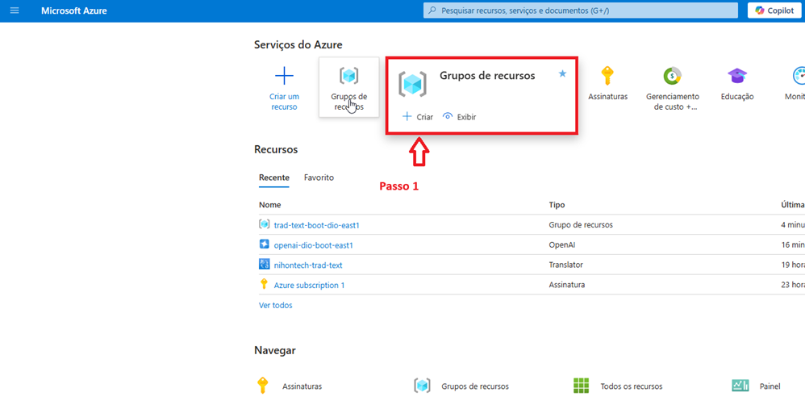
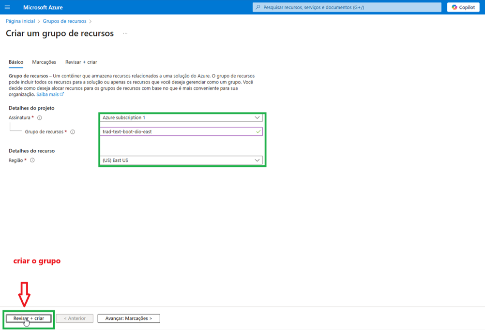
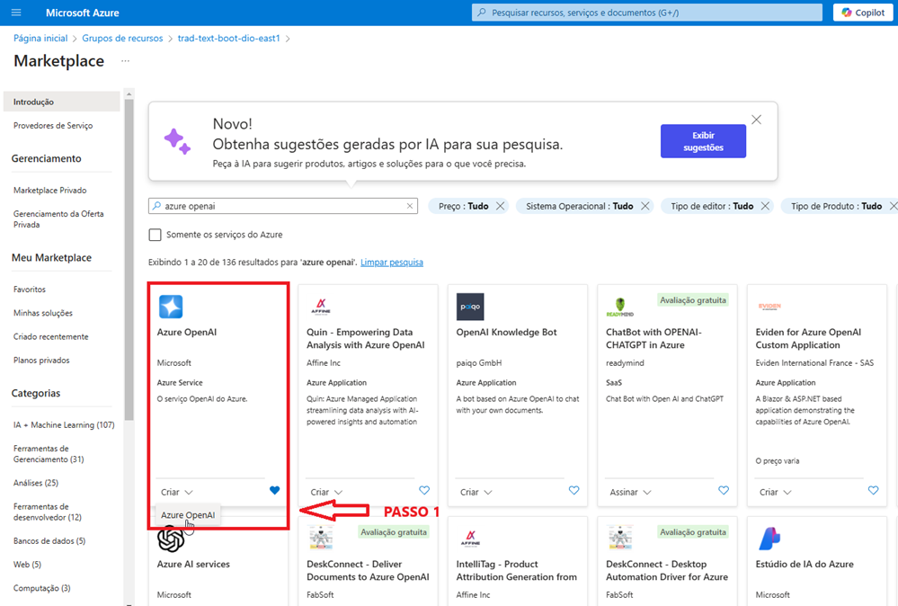
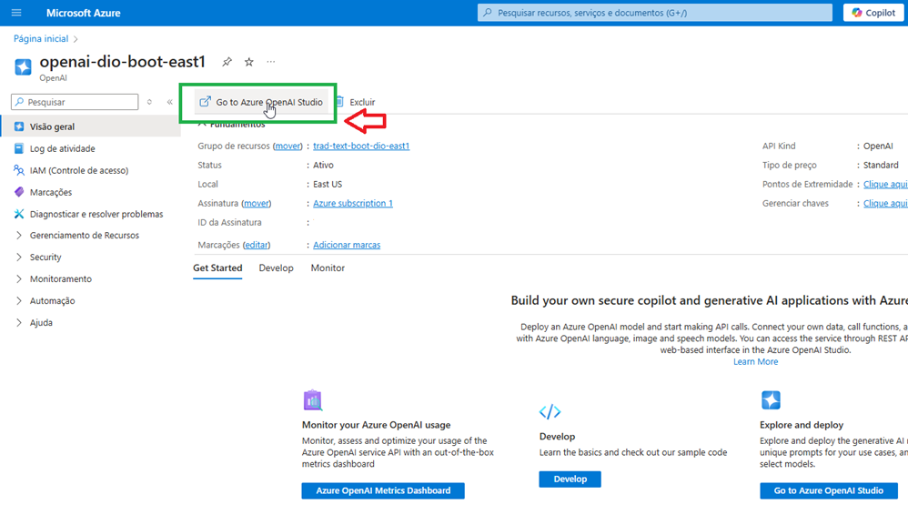
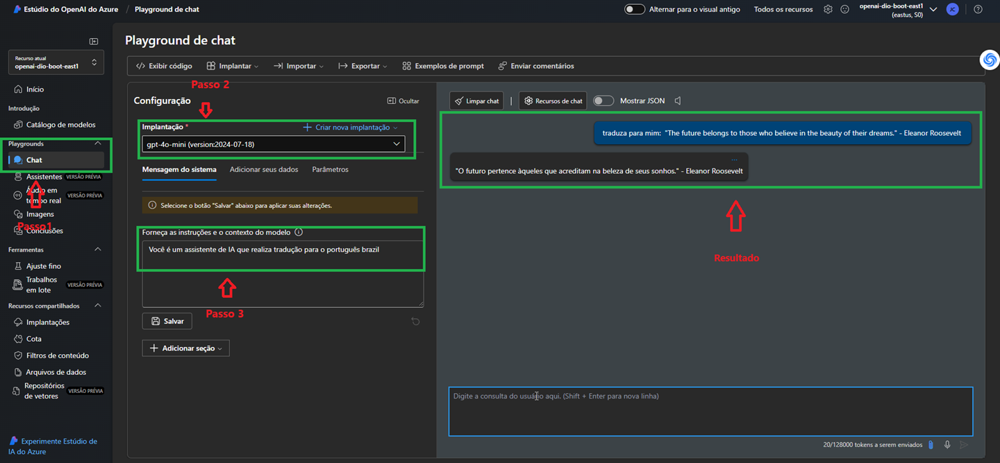
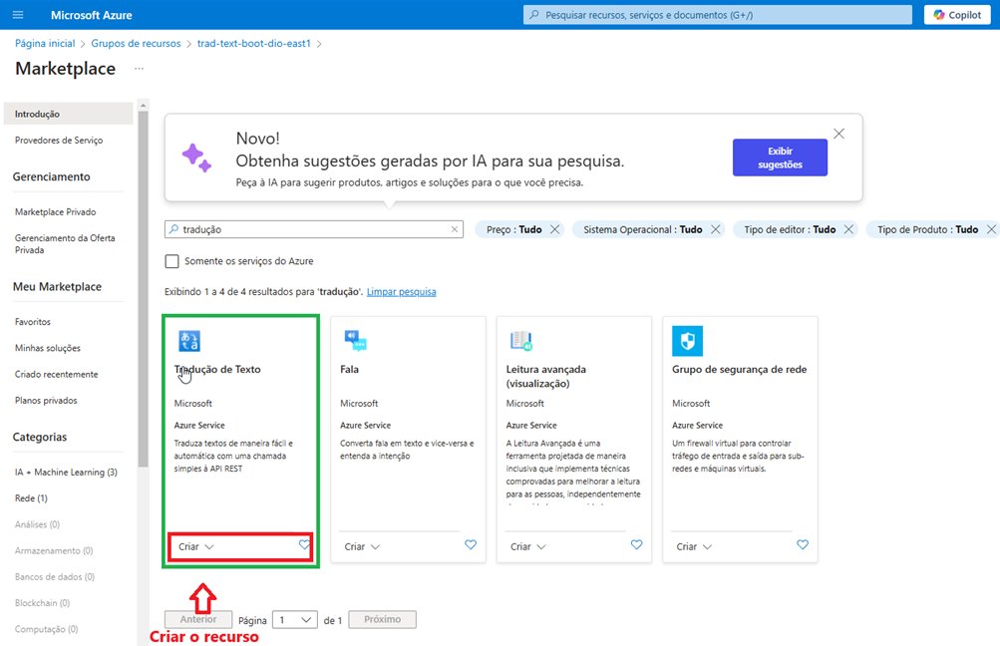
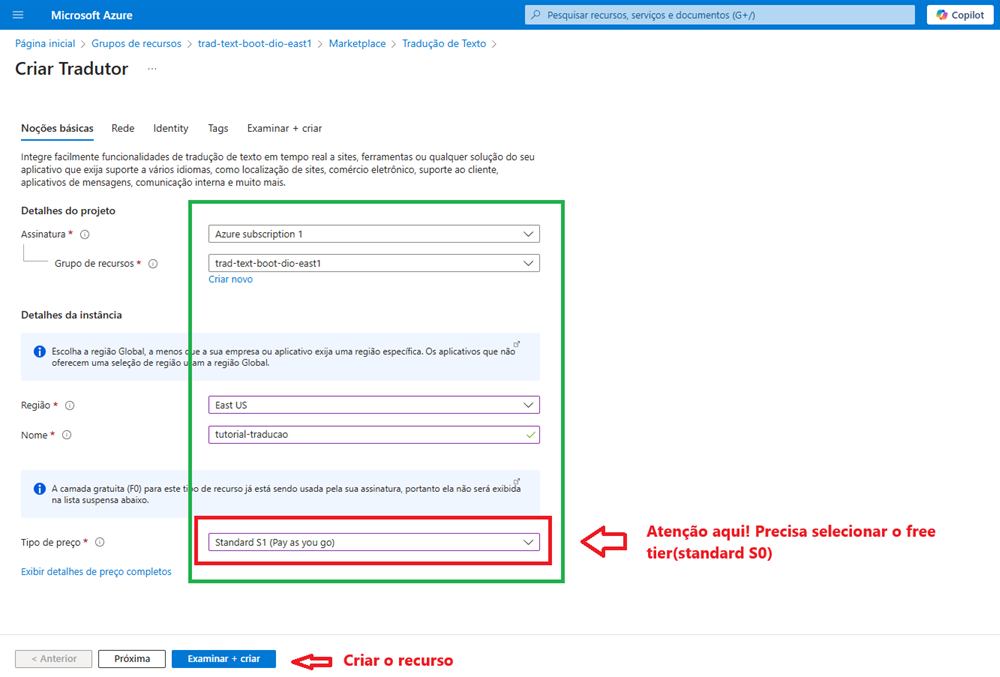
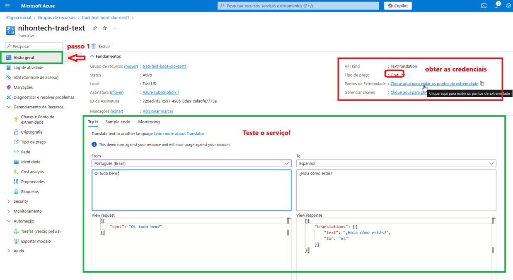

# Azure AI - Tradutor de Artigos Técnicos com Azure OpenAI e Azure AI Translator

Este projeto faz parte do **Bootcamp Microsoft Certification Challenge #1 - AI 102**. O objetivo é desenvolver um  _Tradutor de Artigos Técnicos com AzureAI e Azure AI Translator_. Para isso, é necessário criar um resource group, provisionar os serviços Azure OpenAI e Azure AI Translator, bem como criar o código em Python que consumirá as APIs dos serviços para efetuar a tradução.

O Serviço **OpenAI do Azure** fornece acesso à API REST aos modelos de linguagem avançados do OpenAI, incluindo o1, o1-mini, GPT-4o, GPT-4o mini, GPT-4 Turbo com Visão, GPT-4, GPT-3.5-Turbo e as séries de modelos Embeddings. Esses modelos podem desempenhar tarefas como geração de conteúdo, sumarização, reconhecimento de imagem, pesquisa semântica e tradução de linguagem natural para código. 

O Serviço **Azure AI Translator** é um serviço de tradução automática neural baseado em nuvem que faz parte da família de serviços do Azure AI e pode ser usado com qualquer sistema operacional. O Translator é usado em muitos produtos e serviços da Microsoft, além de ser usado por milhares de empresas em todo o mundo para tradução de idiomas. Ele realiza tradução de textos, documentos e tradução personalizada.

## 1. Síntese da Solução

A solução consiste nos seguintes componentes:
* Tradutor de Artigos:
  *   **Web Scraping:** O código Python extrai o texto do artigo técnico de uma URL fornecida.
  *   **Processamento de Texto:** O texto extraído é limpo, sanitizado e formatado para ser processado pelos serviços de IA.
  *   **Tradução:** O texto processado é enviado ao serviço Azure OpenAI para tradução do texto para o idioma desejado.
  *   **Geração de Markdown:** O texto traduzido é formatado em Markdown para fácil visualização e publicação.
* Tradutor de Documentos:
  *   **Carregamento de Documentos:** O documento é carregado através da lib `docx`.
  *   **Tradução do documento:** O documento é traduzido com Azure Translator.
  *   **Tradução salva:** O texto traduzido é salvo no formato Microsoft Word.

## 2. Solução Detalhada

### 2.1 Criar um Grupo de Recursos 

No portal do Azure, crie um grupo de recursos para organizar os recursos do projeto: o Azure OpenAI e o Azure Translator.





### 2.2 Provisionar o Serviço Azure OpenAI

Crie uma instância do serviço Azure OpenAI. Selecione a região East US, escolha um nome para a instância, e opte pela camada gratuita para começar.




### 2.3 Implantar o Modelo GPT-4 Mini

No Azure OpenAI Studio, implante o modelo GPT-4 Mini, selecionando o "Modo Básico" e a opção "Standard" para a implantação. Guardar a chave de API e o endpoint do Azure OpenAI para utilização posterior.





### 2.4 Provisionar o Serviço Azure Translator

Crie uma instância do serviço Azure Translator no mesmo grupo de recursos. Escolha a região East US para consistência, nomeie a instância e selecione a camada gratuita, que oferece tradução de até 2 milhões de caracteres.  

                                                            



### 2.5 Obter a Chave de Assinatura e o Endpoint do Translator

Acesse as chaves de assinatura e o endpoint do serviço Azure Translator. Anote essas informações, pois serão usadas para autenticar e interagir com o serviço.



## 3. Tradutor de Artigos - Primeira Parte do Projeto

### 3.1 Importar as Bibliotecas

```python
from bs4 import BeautifulSoup
import requests, uuid, json
import os
from dotenv import load_dotenv
```


### 3.2 Definir as Variáveis de Ambiente

Defina as variáveis de ambiente para a chave de assinatura do Azure Translator, endpoint do Translator e endpoint do Azure OpenAI:

```python
# Carregar variáveis de ambiente do arquivo .env
load_dotenv()

API_KEY = os.getenv("AZURE_OPENAI_KEY")
API_ENDPOINT = os.getenv("AZURE_ENDPOINT")
key = os.getenv("TRANSLATOR_API_KEY")
endpoint = os.getenv("TRANSLATOR_ENDPOINT")
location = os.getenv("TRANSLATOR_LOCATION")
```


### 3.3 Criar a Função de Extração de Texto

Crie uma função Python chamada `extract_text()` para extrair texto de uma URL fornecida. Esta função deve:

*   Usar `requests.get()` para buscar o conteúdo HTML da URL.
*   Verificar se a resposta HTTP tem o código de status 200 (sucesso).
*   Criar um objeto `BeautifulSoup` para analisar o HTML.
*   Remover tags `<script>` e `<style>` do HTML.
*   Extrair o texto usando `soup.get_text()`.
*   Limpar o texto removendo caracteres desnecessários, como quebras de linha extras.
*   Retornar o texto limpo.

```python
url="https://dev.to/eric_dequ/steve-jobs-the-visionary-who-blended-spirituality-and-technology-3ppi"
def extract_text(url):
    response = requests.get(url)
    if response.status_code == 200:
        soup = BeautifulSoup(response.text, 'html.parser')
        for script in soup(["script", "style"]):
            script.decompose()
        text = soup.get_text(" ", strip=True)
        return text
    else:
        print("Falha ao buscar a URL. Código de status:", response.status_code)
        return None
extract_text(url)
```
```bash
'Steve Jobs The Visionary Who Blended Spirituality and Technology - DEV Community Skip to content Navigation menu Search Powered by Search Algolia Search Log in Create account DEV Community Close Add reaction Like Unicorn Exploding Head Raised Hands Fire Jump to Comments Save More... Copy link Copy link Copied to Clipboard Share to Twitter Share to LinkedIn Share to Reddit Share to Hacker News Share to Facebook Share to Mastodon Report Abuse Eric Dequevedo Posted on Jun 28 • Originally published at rics-notebook.com Steve Jobs The Visionary Who Blended Spirituality and Technology # stevejobs # apple # iphone # spirituality Steve Jobs: The Visionary Who Blended Spirituality and Technology 🍎🕉️ Steve Jobs,'
```


### 3.4 Criar a Função de Tradução de Texto

Crie uma função Python chamada `translate_article()` para traduzir o texto extraído usando o Azure OpenAI GPT-4o mini. Esta função deve:

*   Definir o endpoint da API de tradução.(ENDPOINT)
*   Criar um cabeçalho de solicitação com a chave de assinatura.(headers)
*   Definir o corpo da solicitação com o texto a ser traduzido.(payload)
*   Enviar uma solicitação POST para a API de tradução usando `requests.post()`.
*   Extrair o texto traduzido da resposta JSON.
*   Retornar o texto traduzido.

```python
def translate_article(text, lang):
    headers = {
    "Content-Type": "application/json",
    "api-key": API_KEY,
    }
    
    # Payload for the request
    payload = {
      "messages": [
        {
          "role": "system",
          "content": [
            {
              "type": "text",
              "text": "Você atua como tradutor de textos"
            }
          ]
        },
        {
          "role": "user",
          "content": [
            {
              "type": "text",
              "text": f"traduza: {text} para o idioma {lang} e responda apenas com a tradução no formato markdown"
            }
          ]
        },    
      ],
      "temperature": 0.7,
      "top_p": 0.95,
      "max_tokens": 900
    }
    
    ENDPOINT = API_ENDPOINT
    
    # Send request
    try:
        response = requests.post(ENDPOINT, headers=headers, json=payload)
        response.raise_for_status()  # Will raise an HTTPError if the HTTP request returned an unsuccessful status code
    except requests.RequestException as e:
        raise SystemExit(f"Failed to make the request. Error: {e}")
    
    # Handle the response as needed (e.g., print or process)
    return (response.json()['choices'][0]['message']['content'])
```

*   **Realizando testes:**

```python
translate_article("The future belongs to those who believe in the beauty of their dreams. - Eleanor Roosevelt","português")
```
```bash
'O futuro pertence àqueles que acreditam na beleza de seus sonhos. - Eleanor Roosevelt'
```

*   **Agora vamos testar com o artigo:** 'https://dev.to/eric_dequ/steve-jobs-the-visionary-who-blended-spirituality-and-technology-3ppi'

```python
url = "https://dev.to/eric_dequ/steve-jobs-the-visionary-who-blended-spirituality-and-technology-3ppi"
text = extract_text(url)
artigo = translate_article(text,"português")
print(artigo)
```
## Steve Jobs: O Visionário Que Misturou Espiritualidade e Tecnologia
🍎🕉️ Steve Jobs, cofundador da Apple e mente por trás de produtos revolucionários como o iPhone, não era apenas um visionário da tecnologia, mas também uma pessoa profundamente espiritual. Sua combinação única de espiritualidade oriental e inovação ocidental permitiu que ele criasse tecnologia que não era apenas funcional, mas também incrivelmente legal e desejável. 📱✨

### A Jornada Espiritual de Steve Jobs 🧘‍♂️
Desde jovem, Steve Jobs foi atraído pela espiritualidade e filosofia orientais. Ele passou sete meses viajando pela Índia em 1974, buscando iluminação espiritual e estudando o budismo. Essa experiência teve um impacto profundo em sua vida e, mais tarde, influenciou sua abordagem aos negócios e ao design de produtos. 🌍🙏

Um dos pontos de virada mais significativos na jornada espiritual de Jobs foi seu encontro com o livro "Be Here Now" de Ram Dass. O livro, que mistura espiritualidade oriental com psicologia ocidental, ressoou profundamente com Jobs e se tornou uma força orientadora em sua vida. 📖💡

As buscas espirituais de Jobs também o levaram a desenvolver uma conexão com o guru indiano Neem Karoli Baba, também conhecido como Maharaj-ji. Embora Jobs nunca tenha conhecido Maharaj-ji pessoalmente, ele sentiu uma forte conexão espiritual com o guru e buscou sua orientação através de intermediários. Esse relacionamento ajudou Jobs a se manter centrado e focado enquanto navegava pelos desafios de liderar uma empresa de tecnologia em rápido crescimento. 🕉️💼

### A Interseção de Espiritualidade e Tecnologia 🌐🧘‍♂️
As crenças espirituais de Steve Jobs influenciaram profundamente sua abordagem à tecnologia e ao design. Ele acreditava que a tecnologia não deveria ser apenas funcional, mas também esteticamente agradável e intuitiva de usar. A visão de Jobs era criar produtos que enriquecessem a vida das pessoas e trouxessem alegria, em vez de simplesmente servir como ferramentas. 🎨💻

O iPhone, talvez a criação mais icônica de Jobs, exemplifica perfeitamente essa filosofia. Com seu design elegante, interface amigável e recursos poderosos, o iPhone revolucionou a indústria de smartphones e estabeleceu um novo padrão para a tecnologia móvel. A atenção aos detalhes de Jobs e seu foco na experiência do usuário, informados por sua perspectiva espiritual, fizeram do iPhone não apenas um dispositivo, mas uma declaração de estilo e individualidade. 📱👨‍💻

A abordagem espiritual de Jobs à liderança também o diferenciou de outros CEOs de tecnologia. Ele fomentou uma cultura de inovação e criatividade na Apple, encorajando sua equipe a pensar de forma diferente e ultrapassar limites. A crença de Jobs no poder da intuição e sua capacidade de "pensar diferente" permitiram que ele antecipasse e moldasse o futuro da tecnologia, em vez de simplesmente reagir às tendências de mercado. 🔮💡

### O Legado de Steve Jobs 🍏🌟
O impacto de Steve Jobs no mundo da tecnologia e sua abordagem única de misturar espiritualidade com inovação continuam a inspirar e influenciar empreendedores e designers ao redor do mundo. Sua visão para a Apple e seu compromisso em criar produtos que enriquecem a vida das pessoas deixaram uma marca indelével na indústria de tecnologia. 🌍💻

Além de suas conquistas tecnológicas, a jornada espiritual de Jobs e sua dedicação ao crescimento pessoal e autodescoberta servem como um lembrete de que sucesso e paz interior não são mutuamente exclusivos. Ao abraçar sua espiritualidade e permitir que ela guiasse seu trabalho, Jobs conseguiu realizar coisas notáveis enquanto permanecia fiel a si mesmo e a seus valores. 🧘‍♂️🏆

Ao refletirmos sobre a vida e o legado de Steve Jobs, podemos nos inspirar em sua capacidade de misturar mundos aparentemente distintos – espiritualidade e tecnologia – em um todo harmonioso. Ao seguir nossos próprios caminhos de autodescoberta e permitir que nossos valores mais profundos informem nosso trabalho, também podemos criar produtos, serviços e experiências que não apenas mudam o mundo, mas também trazem alegria e significado para a vida das pessoas. 🌈

## 4. Tradutor de Documentos - Segunda Parte do Projeto

### 4.1 Criar a Função de Tradução de Texto

Crie uma função Python chamada `translate_text()` para traduzir o texto extraído usando o Azure Translator. Esta função deve:

*   Definir o endpoint da API de tradução como `translator_endpoint + "translate"`.
*   Criar um cabeçalho de solicitação com a chave de assinatura e um ID de cliente.(`headers`)
*   Definir o corpo da solicitação com o texto a ser traduzido, o idioma de origem (inglês) e o idioma de destino (português brasileiro).(`params, body`)
*   Enviar uma solicitação POST para a API de tradução usando `requests.post()`.
*   Extrair o texto traduzido da resposta JSON.
*   Retornar o texto traduzido.

```python
import requests, uuid, json
import os
from dotenv import load_dotenv
def translate_text(text, lang_from, lang_to):        
        # Carregar variáveis de ambiente do arquivo .env
        load_dotenv()
        
        key = os.getenv("TRANSLATOR_API_KEY")
        endpoint = os.getenv("TRANSLATOR_ENDPOINT")
        location = os.getenv("TRANSLATOR_LOCATION")
        
        path = '/translate'
        constructed_url = endpoint + path
        
        params = {
            'api-version': '3.0',
            'from': lang_from,
            'to': lang_to
        }
        
        headers = {
            'Ocp-Apim-Subscription-Key': key,
            # location required if you're using a multi-service or regional (not global) resource.
            'Ocp-Apim-Subscription-Region': location,
            'Content-type': 'application/json',
            'X-ClientTraceId': str(uuid.uuid4())
        }
        
        # You can pass more than one object in body.
        body = [{
            'text': text
        }]
        
        request = requests.post(constructed_url, params=params, headers=headers, json=body)
        response = request.json()
        return response[0]['translations'][0]['text']
```


### 4.2 Carregar um documento word para tradução

```python
from docx import Document
def carregar_texto_word(arquivo):
    doc = Document(arquivo)
    texto_completo = "\n".join([paragrafo.text for paragrafo in doc.paragraphs])
    return texto_completo
```


### 4.3 Criar uma função para salvar o arquivo traduzido no formato word

```python
from io import BytesIO
def trad_para_download(texto, nome_arquivo="tradução.docx"):
    doc = Document()
    for linha in texto.split('\n'):
        doc.add_paragraph(linha)    
    doc.save(nome_arquivo)    
```


## 5. Considerações Adicionais

### 5.1 Gerenciamento de Custos

Monitore o uso dos serviços Azure OpenAI e Azure Translator para controlar os custos. Avalie a possibilidade de utilizar a camada gratuita para projetos menores ou migrar para camadas pagas para volumes maiores.


### 5.2 Segurança

Utilize o Azure Key Vault para armazenar as chaves de API com segurança.


### 5.3 Monitoramento

Implemente o monitoramento para os serviços Azure AI, incluindo alertas para eventos importantes e análise de logs para identificar e solucionar problemas.

## 6. Conclusão

Este passo a passo detalhado fornece um guia abrangente para o desenvolvimento de um projeto de tradução de artigos técnicos e documentos usando a IA do Azure. Ao combinar os serviços Azure OpenAI e Azure Translator, você pode automatizar o processo de tradução, ampliar o alcance do seu conteúdo e melhorar a acessibilidade para um público global.

